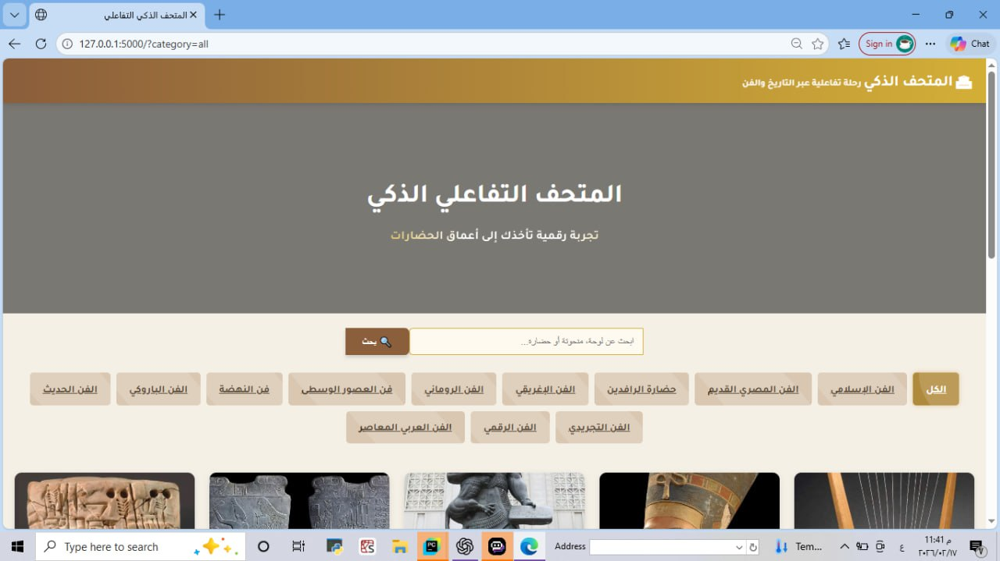
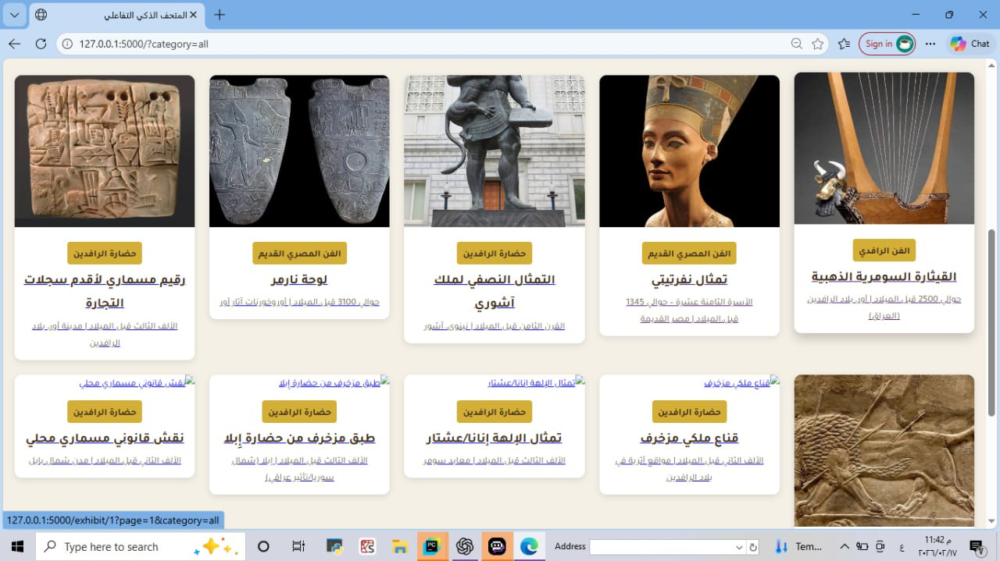

# 🏛️ Smart Interactive Museum System

An advanced interactive museum web application built using Flask and Object-Oriented Programming (OOP) concepts, combined with intelligent exhibit bots.

---

## 🚀 Overview

This project simulates a digital museum where users can:

- Browse exhibits by category
- Search for artifacts using keywords
- View detailed exhibit pages
- Interact with an intelligent bot for each exhibit

The system is designed with strong OOP principles and includes advanced programming concepts such as abstraction, encapsulation, lambda functions, and data processing.

---

## Key Features

### 🔹 Interactive Exhibit System
- Each exhibit has:
  - Name, category, image
  - Historical period and origin
  - Description
- Data loaded dynamically from JSON

### 🔹 Smart Bot (AI-like behavior)
- Each exhibit has its own bot
- Answers questions like:
  - Origin of the artifact
  - Historical period
  - General description
- Supports greeting detection
- Generates dynamic responses using session tracking

### 🔹 Search & Filtering
- Search exhibits by keywords
- Filter by category
- Pagination support

- ## 📸 Screenshots

